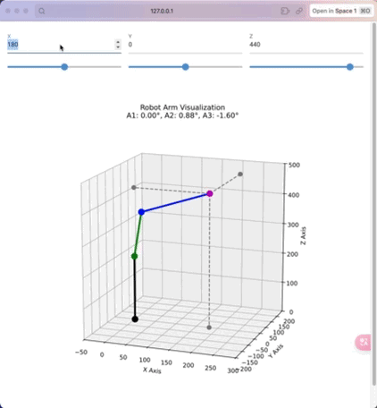

# 演示



# 机械臂运动学方程

## 参数定义
首先定义各参数：
- $\theta_{A1}$, $\theta_{A2}$, $\theta_{A3}$ 为A1、A2、A3关节角度
- $\alpha_{A1}$, $\alpha_{A2}$, $\alpha_{A3}$ 为A1、A2、A3关节坐标
- $X$, $Y$, $Z$ 为末端执行器在世界坐标系中的位置
- $L_1, L_2, L_3, L_4, L_5$ 为机械臂连杆参数

## 正向运动学方程

### 关节角度到关节坐标的映射
$$\alpha_{A1} = \theta_{A1} + \alpha_{A1,start}$$
$$\alpha_{A2} = \theta_{A2} + \alpha_{A2,start}$$
$$\alpha_{A3} = \theta_{A3} + \alpha_{A3,start} - \alpha_{A2}$$

### 关节坐标到笛卡尔坐标(世界坐标)的映射
$$X = ((L_5 + L_4) + L_2 \cos(\alpha_{A2}) + L_3 \cos(\alpha_{A2} + \alpha_{A3})) \cos(\alpha_{A1})$$

$$Y = ((L_5 + L_4) + L_2 \cos(\alpha_{A2}) + L_3 \cos(\alpha_{A2} + \alpha_{A3})) \sin(\alpha_{A1})$$

$$Z = L_1 + L_2 \sin(\alpha_{A2}) + L_3 \sin(\alpha_{A2} + \alpha_{A3})$$

其中，$L_5$为杆长修正长度，$\alpha_{A1,start}$, $\alpha_{A2,start}$, $\alpha_{A3,start}$为各关节的起始角度偏移。


# 机械臂逆运动学方程推导

从已知的正向运动学方程，我将推导出逆运动学方程，即根据末端执行器的笛卡尔坐标$(X, Y, Z)$求解关节角度$(\theta_{A1}, \theta_{A2}, \theta_{A3})$。

## 推导过程

### 步骤1: 求解$\alpha_{A1}$
从正向运动学方程中可以看出，$X$和$Y$坐标与$\alpha_{A1}$的关系为：
$$X = r \cdot \cos(\alpha_{A1})$$
$$Y = r \cdot \sin(\alpha_{A1})$$

其中$r = (L_5 + L_4) + L_2 \cos(\alpha_{A2}) + L_3 \cos(\alpha_{A2} + \alpha_{A3})$

因此：
$$\alpha_{A1} = \text{atan2}(Y, X)$$

### 步骤2: 计算辅助变量
定义辅助变量：
$$r = \sqrt{X^2 + Y^2}$$
$$\rho = r - (L_5 + L_4)$$
$$\zeta = Z - L_1$$

### 步骤3: 求解$\alpha_{A3}$
使用余弦定律：
$$\rho^2 + \zeta^2 = L_2^2 + L_3^2 + 2L_2L_3\cos(\alpha_{A3})$$

整理得：
$$\cos(\alpha_{A3}) = \frac{\rho^2 + \zeta^2 - L_2^2 - L_3^2}{2L_2L_3}$$

定义$D = \frac{\rho^2 + \zeta^2 - L_2^2 - L_3^2}{2L_2L_3}$，则：
$$\alpha_{A3} = \text{atan2}(\pm\sqrt{1-D^2}, D)$$

其中符号取决于机械臂的构型（肘上或肘下）。

### 步骤4: 求解$\alpha_{A2}$
$$\alpha_{A2} = \text{atan2}(\zeta, \rho) - \text{atan2}(L_3\sin(\alpha_{A3}), L_2 + L_3\cos(\alpha_{A3}))$$

### 步骤5: 计算关节角度
根据关节角度和关节坐标的关系，最终求得：
$$\theta_{A1} = \alpha_{A1} - \alpha_{A1,\text{start}}$$
$$\theta_{A2} = \alpha_{A2} - \alpha_{A2,\text{start}}$$
$$\theta_{A3} = \alpha_{A3} - \alpha_{A3,\text{start}} + \alpha_{A2}$$

## 完整逆运动学方程

给定末端执行器位置$(X, Y, Z)$，关节角度可以通过以下方程求解：

1. $\alpha_{A1} = \text{atan2}(Y, X)$
2. $r = \sqrt{X^2 + Y^2}$
3. $\rho = r - (L_5 + L_4)$
4. $\zeta = Z - L_1$
5. $D = \frac{\rho^2 + \zeta^2 - L_2^2 - L_3^2}{2L_2L_3}$
6. $\alpha_{A3} = \text{atan2}(\pm\sqrt{1-D^2}, D)$
7. $\alpha_{A2} = \text{atan2}(\zeta, \rho) - \text{atan2}(L_3\sin(\alpha_{A3}), L_2 + L_3\cos(\alpha_{A3}))$
8. $\theta_{A1} = \alpha_{A1} - \alpha_{A1,\text{start}}$
9. $\theta_{A2} = \alpha_{A2} - \alpha_{A2,\text{start}}$
10. $\theta_{A3} = \alpha_{A3} - \alpha_{A3,\text{start}} + \alpha_{A2}$

# 基于雅可比矩阵的机械臂逆运动学求解

## 雅可比矩阵方法原理

雅可比矩阵方法是求解机械臂逆运动学的一种数值迭代方法，特别适用于难以获得解析解的情况。该方法基于末端执行器位置与关节角度之间的微分关系。

### 基本原理

设机械臂末端执行器位置为 $\mathbf{X} = [x, y, z]^T$，关节角度为 $\mathbf{\Theta} = [\theta_1, \theta_2, \theta_3]^T$，则正向运动学可表示为：

$$\mathbf{X} = f(\mathbf{\Theta})$$

雅可比矩阵 $\mathbf{J}$ 定义为位置对关节角度的偏导数：

$$\mathbf{J} = \frac{\partial \mathbf{X}}{\partial \mathbf{\Theta}}$$

对于微小变化，有：

$$\Delta \mathbf{X} \approx \mathbf{J} \cdot \Delta \mathbf{\Theta}$$

逆运动学求解时，我们已知目标位置变化 $\Delta \mathbf{X}$，需求解关节角度变化 $\Delta \mathbf{\Theta}$：

$$\Delta \mathbf{\Theta} = \mathbf{J}^{-1} \cdot \Delta \mathbf{X}$$

## 雅可比矩阵推导

对于我们的三自由度机械臂，由于 $\theta_1$ 只影响 $x$ 和 $y$ 坐标的平面旋转，我们可以先求解 $\theta_1$，然后使用雅可比矩阵方法求解 $\theta_2$ 和 $\theta_3$。

### $\theta_1$ 的求解

根据正向运动学方程，$\theta_1$ 可直接求解：

$$\theta_1 = \alpha_{A1} - \alpha_{A1,\text{start}} = \text{atan2}(y, x) - \alpha_{A1,\text{start}}$$

### $\theta_2$ 和 $\theta_3$ 的雅可比矩阵

对于 $\theta_2$ 和 $\theta_3$，我们考虑平面内的 $(r, z)$ 坐标，其中 $r = \sqrt{x^2 + y^2}$。

根据正向运动学方程，我们有：

$$r = (L_5 + L_4) + L_2 \cos(\alpha_{A2}) + L_3 \cos(\alpha_{A2} + \alpha_{A3})$$
$$z = L_1 + L_2 \sin(\alpha_{A2}) + L_3 \sin(\alpha_{A2} + \alpha_{A3})$$

其中 $\alpha_{A2} = \theta_2 + \alpha_{A2,\text{start}}$，$\alpha_{A3} = \theta_3 + \alpha_{A3,\text{start}} - \alpha_{A2}$。

计算雅可比矩阵元素：

$$J_{11} = \frac{\partial r}{\partial \theta_2} = -L_2 \sin(\alpha_{A2}) - L_3 \sin(\alpha_{A2} + \alpha_{A3}) \cdot \frac{\partial (\alpha_{A2} + \alpha_{A3})}{\partial \theta_2}$$

$$J_{12} = \frac{\partial r}{\partial \theta_3} = -L_3 \sin(\alpha_{A2} + \alpha_{A3}) \cdot \frac{\partial (\alpha_{A2} + \alpha_{A3})}{\partial \theta_3}$$

$$J_{21} = \frac{\partial z}{\partial \theta_2} = L_2 \cos(\alpha_{A2}) + L_3 \cos(\alpha_{A2} + \alpha_{A3}) \cdot \frac{\partial (\alpha_{A2} + \alpha_{A3})}{\partial \theta_2}$$

$$J_{22} = \frac{\partial z}{\partial \theta_3} = L_3 \cos(\alpha_{A2} + \alpha_{A3}) \cdot \frac{\partial (\alpha_{A2} + \alpha_{A3})}{\partial \theta_3}$$

考虑到 $\frac{\partial \alpha_{A2}}{\partial \theta_2} = 1$，$\frac{\partial \alpha_{A3}}{\partial \theta_2} = -1$，$\frac{\partial \alpha_{A3}}{\partial \theta_3} = 1$，
以及 $\frac{\partial (\alpha_{A2} + \alpha_{A3})}{\partial \theta_2} = 0$，$\frac{\partial (\alpha_{A2} + \alpha_{A3})}{\partial \theta_3} = 1$，

简化后得到：

$$J_{11} = -L_2 \sin(\alpha_{A2}) - L_3 \sin(\alpha_{A2} + \alpha_{A3}) \cdot 0 = -L_2 \sin(\alpha_{A2})$$

$$J_{12} = -L_3 \sin(\alpha_{A2} + \alpha_{A3}) \cdot 1 = -L_3 \sin(\alpha_{A2} + \alpha_{A3})$$

$$J_{21} = L_2 \cos(\alpha_{A2}) + L_3 \cos(\alpha_{A2} + \alpha_{A3}) \cdot 0 = L_2 \cos(\alpha_{A2})$$

$$J_{22} = L_3 \cos(\alpha_{A2} + \alpha_{A3}) \cdot 1 = L_3 \cos(\alpha_{A2} + \alpha_{A3})$$

因此，雅可比矩阵为：

$$\mathbf{J} = \begin{bmatrix} 
-L_2 \sin(\alpha_{A2}) & -L_3 \sin(\alpha_{A2} + \alpha_{A3}) \\
L_2 \cos(\alpha_{A2}) & L_3 \cos(\alpha_{A2} + \alpha_{A3})
\end{bmatrix}$$

## 迭代求解算法

基于雅可比矩阵，我们可以设计迭代算法求解逆运动学：

1. 首先计算 $\theta_1 = \text{atan2}(y, x) - \alpha_{A1,\text{start}}$
2. 初始化 $\theta_2$ 和 $\theta_3$ 的猜测值
3. 迭代执行以下步骤直到收敛：
   a. 使用当前关节角度通过正向运动学计算末端位置 $(r_{\text{current}}, z_{\text{current}})$
   b. 计算位置误差 $\Delta r = r_{\text{target}} - r_{\text{current}}$, $\Delta z = z_{\text{target}} - z_{\text{current}}$
   c. 计算当前关节角度下的雅可比矩阵 $\mathbf{J}$
   d. 求解关节角度增量 $\Delta \mathbf{\Theta} = \mathbf{J}^{-1} \cdot \Delta \mathbf{X}$
   e. 更新关节角度 $\theta_2 = \theta_2 + \eta \cdot \Delta \theta_2$, $\theta_3 = \theta_3 + \eta \cdot \Delta \theta_3$，其中 $\eta$ 为学习率

### 算法实现细节

1. **雅可比矩阵计算**：
   ```python
   def compute_jacobian(theta2, theta3):
       # 计算实际关节坐标（弧度）
       a2_coord = A2_START_ANGLE + theta2
       a3_coord = A3_START_ANGLE + theta3 - a2_coord

       # 计算雅可比矩阵元素
       j11 = -L2 * np.sin(a2_coord) - L3 * np.sin(a2_coord + a3_coord)
       j12 = -L3 * np.sin(a2_coord + a3_coord)
       j21 = L2 * np.cos(a2_coord) + L3 * np.cos(a2_coord + a3_coord)
       j22 = L3 * np.cos(a2_coord + a3_coord)

       return np.array([[j11, j12], [j21, j22]])
   ```

2. **逆运动学求解**：
   ```python
   def inverse_kinematics(x, y, z, max_iterations=100, tolerance=1e-6, learning_rate=0.1):
       # 计算theta1
       theta1 = np.arctan2(y, x)

       # 目标水平距离
       r_target = np.sqrt(x**2 + y**2)

       # 初始猜测（弧度）
       theta2 = 0  # 初始猜测值
       theta3 = 0  # 初始猜测值

       for i in range(max_iterations):
           # 使用当前的关节角度计算末端位置
           r_current, z_current = forward_kinematics(theta2, theta3)

           # 计算误差
           error_r = r_target - r_current
           error_z = z - z_current
           error = np.array([error_r, error_z])

           # 检查是否收敛
           if np.linalg.norm(error) < tolerance:
               print(f"逆运动学求解收敛，迭代次数: {i + 1}")
               break

           # 计算雅可比矩阵
           J = compute_jacobian(theta2, theta3)

           # 计算关节角度更新
           try:
               delta = np.linalg.solve(J, error)
           except np.linalg.LinAlgError:
               # 使用伪逆
               J_pinv = np.linalg.pinv(J)
               delta = J_pinv @ error

           # 更新关节角度（使用学习率控制步长）
           theta2 += delta[0] * learning_rate
           theta3 += delta[1] * learning_rate

           if i == max_iterations - 1:
               print("警告：逆运动学求解未收敛，达到最大迭代次数")

       return theta1, theta2, theta3
   ```

## 算法收敛性分析

雅可比矩阵方法的收敛性受多种因素影响：

1. **初始猜测值**：良好的初始猜测可以加速收敛。可以使用上一时刻的关节角度作为初始猜测。

2. **学习率选择**：
   - 过大的学习率可能导致震荡或发散
   - 过小的学习率会导致收敛缓慢
   - 自适应学习率策略可以提高收敛效率

3. **奇异性处理**：当雅可比矩阵接近奇异时（行列式接近零），直接求逆可能导致数值不稳定。代码中使用了伪逆来处理这种情况：
   ```python
   try:
       delta = np.linalg.solve(J, error)
   except np.linalg.LinAlgError:
       # 使用伪逆
       J_pinv = np.linalg.pinv(J)
       delta = J_pinv @ error
   ```

4. **阻尼最小二乘法**：为进一步提高稳定性，可以考虑使用阻尼最小二乘法（Damped Least Squares）：
   $$\Delta \mathbf{\Theta} = \mathbf{J}^T(\mathbf{J}\mathbf{J}^T + \lambda \mathbf{I})^{-1}\Delta \mathbf{X}$$
   其中 $\lambda$ 为阻尼因子，$\mathbf{I}$ 为单位矩阵。

## 优化策略

1. **变步长策略**：根据误差大小动态调整学习率
   $$\eta = \eta_0 \cdot \min(1, \frac{\epsilon_{\max}}{||\Delta \mathbf{X}||})$$

2. **牛顿-拉夫森法**：在雅可比迭代的基础上引入二阶导数信息，可以加速收敛

3. **约束处理**：添加关节限位约束，确保求解结果在机械臂的工作范围内
   ```python
   # 关节限位约束
   theta2 = np.clip(theta2, THETA2_MIN, THETA2_MAX)
   theta3 = np.clip(theta3, THETA3_MIN, THETA3_MAX)
   ```

4. **多初始值尝试**：当单次求解失败时，可以尝试多个不同的初始猜测值

## 结论

雅可比矩阵方法是求解机械臂逆运动学的有效数值方法，特别适用于难以获得解析解的复杂机构。通过迭代优化，该方法可以高效地求解关节角度，实现末端执行器的精确定位。在实际应用中，需要注意处理奇异性、选择合适的学习率和初始值，以确保算法的稳定性和收敛性。

# 致谢

本项目绝大多数由 AI 创作完成，感谢 `claude-3-7-sonnet-thinking` 与 `gemini-2.0-flash-exp` 的无私奉献。